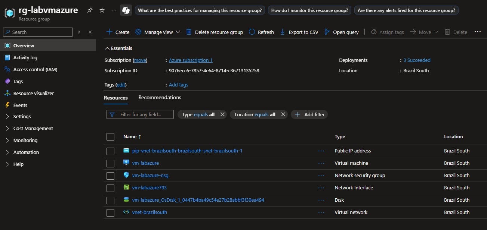
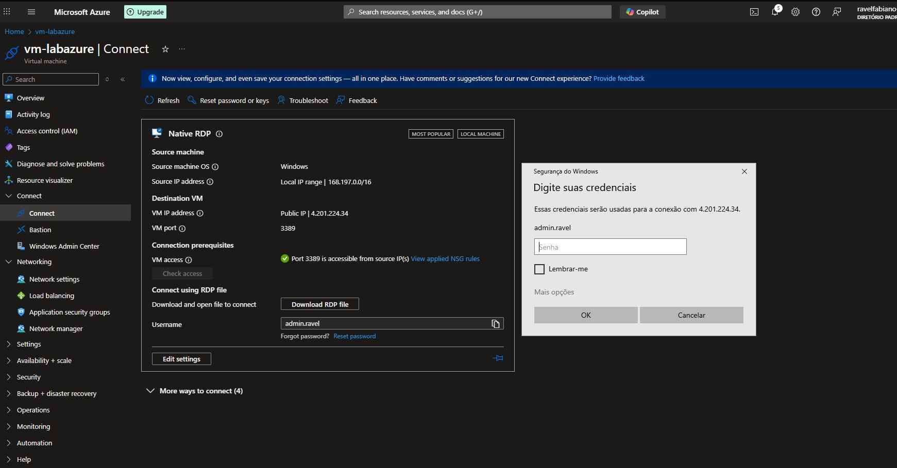

# Desafio: Criando máquinas Virtuais na Azure

Este repositório documenta o processo de criação de uma máquina virtual no Portal da Microsoft Azure, como parte do desafio do bootcamp "Microsoft - Azure AZ-900" da DIO.  
O objetivo é consolidar os conceitos de máquinas virtuais e praticar a documentação técnica no GitHub.

## Resumo

Entendi o básico sobre algumas opções disponíveis para criação de uma Virtual Machine no Azure. Como Zonas de disponibilidades, contas de armazenamento, grupos de recursos, redes virtuais.
Comecei criando um "Resource Group", um grupo de recursos para agrupar todos os recursos criados para esse laboratório de máquina virtual.
Após a criação do RG, criei uma Virtual Machine (VM) com Windows Server 2025, na região da América do Sul, aprendi um pouco sobre a diferença de criação de recursos em determinadas regiões, bem como os valores de cada opção.
Criei uma VNet (Virtual Network), simulando a rede local do servidor.
E executei a VM, utilizando IP Público.
Após o teste e alguns minutos de uso da VM, deletei a máquina virtual, bem como IP, e, após isso, deletei o grupo de recursos com a Vnet e demais recursos restantes.

## Capturas de tela
Segue algumas imagens no portal Azure:

## Conclusão
Com este laboratório foi possível:
- Praticar a criação de uma Virtual Machine no Azure
- Aprender algumas funções correlacionadas
- Entender os conceitos de rede e IP Público
- Documentar a experiência no GitHub
